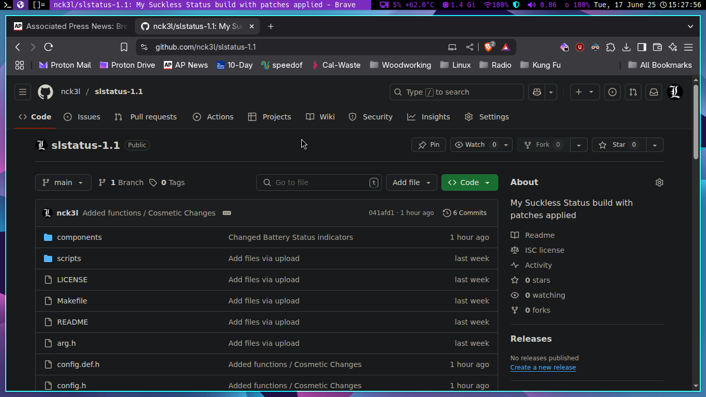

slstatus - suckless status
==========================
slstatus is a small tool for providing system status information to other
programs over the EWMH property of the root window (used by dwm(1)) or
standard input/output. It is designed to be as efficient as possible by
only issuing the minimum of system calls required.

Aside from the features below, my build has 2 functions. One is for volume,
the other is to check for my vpn connection.

Features
--------
- Battery percentage/state/time left
- Cat (read file)
- CPU usage
- CPU frequency
- Custom shell commands
- Date and time
- Disk status (free storage, percentage, total storage and used storage)
- Available entropy
- Username/GID/UID
- Hostname
- IP address (IPv4 and IPv6), interface status
- Kernel version
- Keyboard indicators
- Keymap
- Load average
- Network speeds (RX and TX)
- Number of files in a directory (hint: Maildir)
- Memory status (free memory, percentage, total memory and used memory)
- Swap status (free swap, percentage, total swap and used swap)
- Temperature
- Uptime
- Volume percentage
- WiFi signal percentage and ESSID

Installation
------------
Edit config.mk to match your local setup (slstatus is installed into the
/usr/local namespace by default).

Afterwards enter the following command to build and install slstatus (if
necessary as root):

    make clean install

I do not use this method. I make it and then link the executeable to my 
~/.local/bin folder and have that path declared in my X config files.

Configuration
-------------
slstatus can be customized by creating a custom config.h and (re)compiling the
source code. This keeps it fast, secure and simple.
